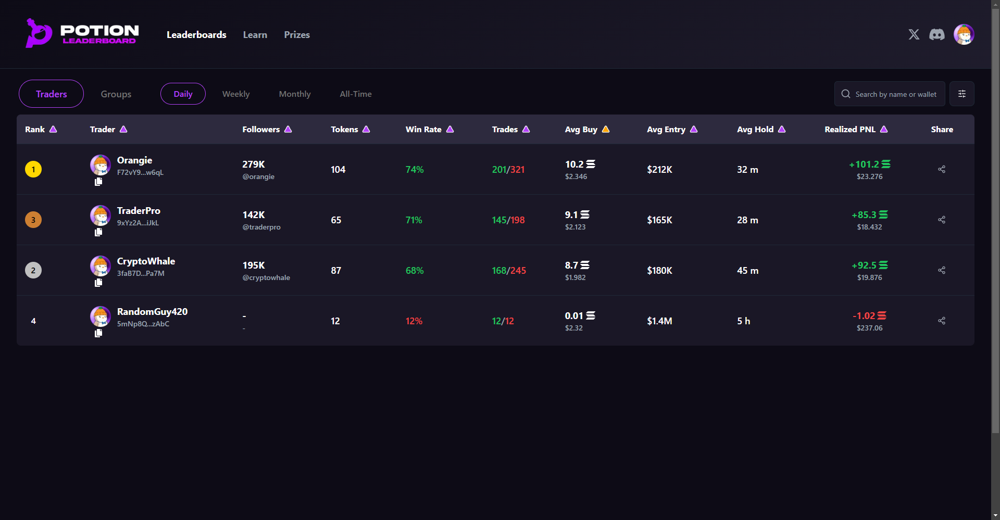

## Potion Challenge



Explore the live demo at [https://potion-twiz.vercel.app/](https://potion-twiz.vercel.app/).

## Instructions to Run Locally

This project is built using Next.js, TypeScript, Tailwind CSS, Shadcn, and Framer Motion.

1. Install the necessary packages:
   ```bash
   npm install
   ```

2. Start the development server:
   ```bash
   npm run dev
   ```

3. Open your browser and navigate to `http://localhost` to view the application.
